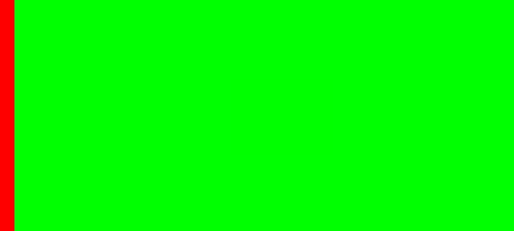

# SafeArea node

An addon for Godot Game Engine which adds a SafeArea node.

Basically it's a MarginContainer which takes margins from OS.get_window_safe_area().

# Screenshots

# Usage

Just put it as father and its anchors to get fullscreen.  
All inside it will be moved to keep in the safe area.

# License

[GPLv3](LICENSE)